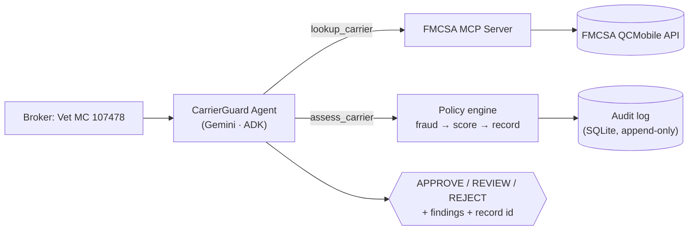
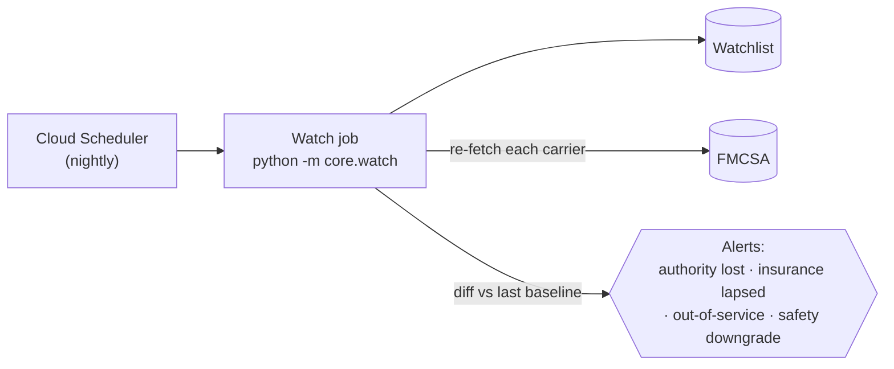

# 🚛 CarrierGuard

**An AI agent that helps freight brokers check carriers against live FMCSA data, and keeps an eye on them after the load is booked.**

Built for the Google × Kaggle *AI Agents Intensive (Vibe Coding)* capstone · Track: **Agents for Business**

> CarrierGuard supports a broker's carrier due-diligence process. It is informational and **is not legal advice**.

---

## The problem

On May 14, 2026, the U.S. Supreme Court ruled in *Montgomery v. Caribe Transport II* that freight brokers can be sued under state law for negligently hiring an unsafe carrier. The decision stripped away the federal preemption defense brokers had long used to get these claims dismissed. Overnight, roughly 17,000 small U.S. freight brokerages became exposed for who they hire to haul freight, right in the middle of a freight-fraud wave (double-brokering, identity theft).

Brokers' counsel now say every broker needs a written protocol for onboarding each carrier and then monitoring it for as long as it hauls. But the existing tools are carrier-flagging databases, not a broker's own assistant. And per counsel, no single tool does end-to-end vetting, continuous re-verification, and a defensible decision trail in one place. That gap is CarrierGuard.

## What it does

- **Vet (on demand):** give it a carrier's MC number and it pulls the live FMCSA record, scores the risk, and returns APPROVE / REVIEW / REJECT with the reasons and a dated audit record.
- **Watch (scheduled):** keeps a watchlist of your active carriers and re-checks them every night, flagging the moment a carrier's authority is revoked, its insurance lapses, it goes out of service, or its safety rating drops.

Verified live against real carriers:

| Carrier | MC# | Decision | Why |
|---|---|---|---|
| Old Dominion Freight Line | 107478 | **APPROVE** | active authority, $1M insurance, Satisfactory |
| B Swift Transportation | 1217040 | **REJECT** | inactive authority + out-of-service + uninsured (3× HIGH) |

## Why an agent?

This can't be a single chatbot prompt. CarrierGuard needs live external data from FMCSA, pulled on a schedule, across several tools, with a persistent audit trail. That's exactly what an agent gives you and a one-shot prompt can't. The LLM orchestrates and explains, but the APPROVE / REVIEW / REJECT decision itself is computed deterministically by a versioned policy, never left to the model.

## Architecture

**Vet flow**



**Watch flow**



The risk logic lives in a pure `core/` package (no ADK/GCP imports), so it's fast and fully unit-tested. `app/` is the thin ADK agent layer, and `mcp_server/` serves FMCSA lookups over MCP.

## Course concepts demonstrated

| Concept | Where |
|---|---|
| **Agent (ADK)** | `app/agent.py` — an `LlmAgent` (Gemini via Vertex) orchestrating tools |
| **MCP Server** | `mcp_server/server.py` — FastMCP server exposing `lookup_carrier`; the agent consumes it over stdio |
| **Security** | no secrets in code (`.env`, git-ignored), append-only audit log, advisory decisions + "not legal advice" disclaimer |
| **Agents CLI** | scaffolded, run, and deployed with `agents-cli` |
| **Deployability** | Cloud Run / Agent Runtime + Cloud Scheduler (see *Deployment*) |

## Project structure

```
carrierguard/
├── core/                  # Pure domain logic (no ADK/GCP) — fully unit-tested
│   ├── models.py          # CarrierData, FraudSignal, RiskResult, VettingRecord
│   ├── fmcsa/client.py    # FMCSA QCMobile fetch + parse  (+ recorded fixtures)
│   ├── fraud.py           # risk/fraud heuristics
│   ├── policy.py + scorer.py   # versioned scoring policy → APPROVE/REVIEW/REJECT
│   ├── record.py          # vetting record + render
│   ├── storage.py         # append-only audit log + watchlist (SQLite)
│   └── watch.py           # scheduled re-check + change alerts (CLI)
├── mcp_server/server.py   # FMCSA MCP server (FastMCP)
├── app/                   # ADK agent
│   ├── agent.py           # the CarrierGuard LlmAgent
│   └── tools.py           # deterministic assess_carrier tool
├── tests/unit/            # 35 tests (pure logic, no network/credentials)
└── docs/                  # design spec + implementation plan
```

## Setup

**Prerequisites:** [uv](https://docs.astral.sh/uv/), `agents-cli` (`uv tool install google-agents-cli`), Google Cloud SDK with application-default credentials (`gcloud auth application-default login`), and a free [FMCSA QCMobile WebKey](https://mobile.fmcsa.dot.gov/QCDevsite/docs/getStarted).

```bash
uv sync                       # creates a Python 3.13 venv + installs deps
cp .env.example .env          # then add your FMCSA_WEBKEY
```

`.env`:
```
FMCSA_WEBKEY=your-fmcsa-webkey
```
Gemini runs via Vertex AI using your gcloud credentials — no API key needed.

## Usage

```bash
# Vet a carrier on demand
agents-cli run "Vet carrier MC 107478"      # -> APPROVE
agents-cli run "Vet carrier MC 1217040"     # -> REJECT
agents-cli playground                        # chat UI in the browser

# Watch mode
python -m core.watch add 107478 1217040      # add carriers to the watchlist
python -m core.watch                         # re-check + print alerts (run on a schedule)
```

## Testing

```bash
uv run pytest tests/unit -q     # 35 tests, ~1s, no network or credentials needed
```
Tests run against recorded FMCSA fixtures and injected fetchers, so the suite is fast and deterministic. Agent behavior is verified separately via `agents-cli run`.

## Security & governance

- **No secrets in code.** The WebKey lives in a git-ignored `.env`; deployments use Secret Manager.
- **Defensible audit trail.** Every decision is written to an append-only SQLite log (the artifact that limits negligent-hiring exposure).
- **Human-in-the-loop.** Decisions are advisory; the agent never books or rejects on its own, and every output carries the "not legal advice" disclaimer.

## Deployment

CarrierGuard runs locally as-is. To deploy the agent and schedule the nightly watch:

```bash
agents-cli scaffold enhance . --deployment-target cloud_run
agents-cli deploy
# schedule `python -m core.watch` nightly via Cloud Scheduler
```

(Deployment is optional for judging; steps are provided for reproducibility.)

## Tech stack

Python 3.13 · Google ADK · Gemini (Vertex AI) · MCP (FastMCP) · `requests` · SQLite · pytest · `agents-cli`. Data: the free, public **FMCSA QCMobile API**.
